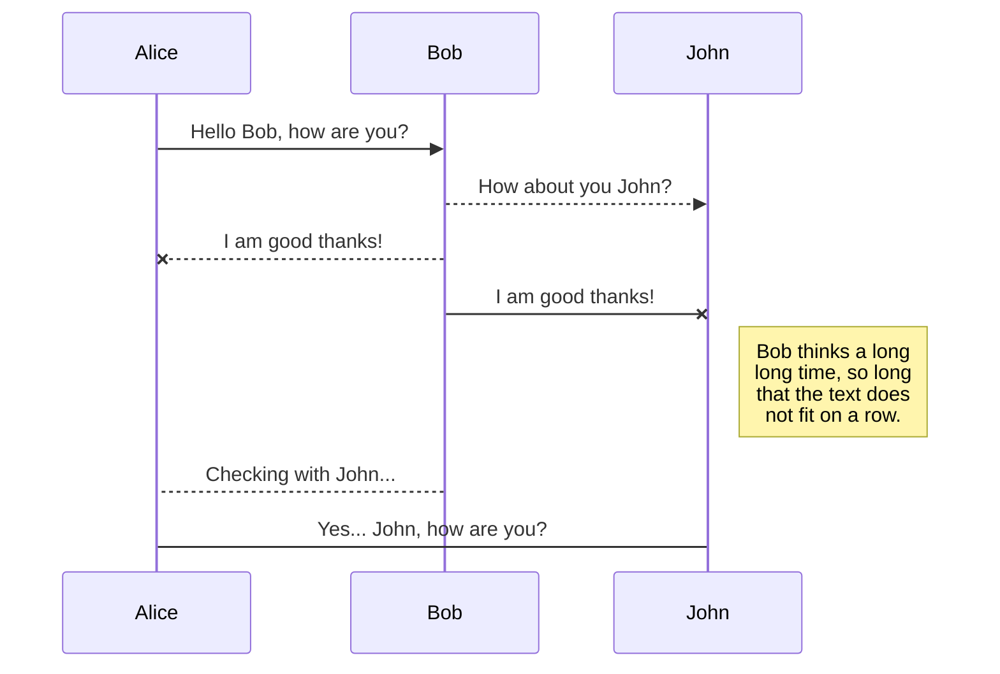
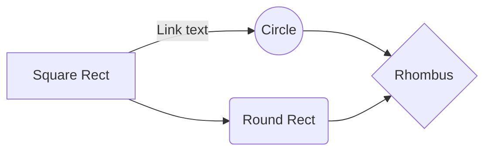

# The Game of Chess: An Analysis

## About Us
Authors: Drake Doyle, Giancarlo Giannetti, Hailey D'Souza, Mohammed Raafe

# Introduction

The game of chess is one of the oldest games in history. Played by numerous peoples across several continents throughout time. It's a game that almost everyone in the world is familiar with in some capacity. You would think that a game that old has nothing new to tell us? Think again.

This project involves the analysis of a dataset containing over 20,000 online chess games. This plethora of data will offer a valuable insight into the game of chess, specifically the online variants of the game. It will make you look at the all-time classic in an entirely new light.

This dataset was collected from the free online chess website lichess.org and the collector, Mitchell J, provides the full dataset here:
https://www.kaggle.com/datasnaek/chess

The dataset has the following attributes: 

 - **id** - An identifier of a unique game.
 - **rated** - A true/false value on whether or not a game is rated (i.e. wins/losses effect skill ranking)
 - **created_at** - Timestamp value of when the game was created.
 - **last_move_at** - Timestamp value of when the game ended.
 - **turns** - The number of turns that occurred in the game.
 - **victory_status** - How the game ended (checkmate, resignation, draw, etc)
 - **winner** - The winning colour (white or black or draw if there is no winner)
 - **increment_code** - A specific concept in competitive chess in which there is a countdown timer when someone has not made a move. Some increment codes also allow a player to recieve extra time for making a move.
 - **white_id** - player name of the white side
 - **white_rating** - skill rating of the white player
 - **black_id** - player name of the black side
 - **black_rating** - skill rating of the black player
 - **moves** - chess board coordinates of each move in sequence 
 - **opening_eco** - starting move coordinate
 - **opening_name** - official title of the starting move
 - **opening_ply** - number of moves during the opening phase
 
 Now that we have a firm understanding of the dataset we are working with. Let's begin the deep dive into the interesting discoveries from analyzing 20,000+ chess games! 

# Discussion

During the analysis of the vast collection of chess games, there was some interesting insights that our group discovered. Insights that specifically related to the lichess.org skill rating system and the final outcome of the individual chess games.

But first, let's lay the foundation of how this data was aggregated. Since this collection contained a vast amount of numeric skill ratings that don't mean anything at face value, we devised 5 separate skill rating categories to make the data easier to read. Here are the categories from most skilled to least skilled:

 - Very High
 - High
 - Average
 - Low
 - Very Low
 
Let's observe the data table collected from the chess games by the skill level of the winner player.
[Paste Chart Here]

From this data table, there are several distinct trends that can be observed in these chess games of varying skill levels.

Let's first analyze the data as it relates to the percentage of games in which a resignation occurred. 

It seems like common sense that resignations should be highest at the lower skill level games. Players that aren't very good at chess might be more likely to quit out of frustration or anger. Maybe players at that skill level just aren't as interested in chess and might resign from the game from sheer boredom. But surprisingly, the data points in the complete opposite trend!

We have found through our observations that the relationship between the percentage of resignations and skill level is that the more skilled the player is, the more likely they are to resign from the game. 

It's not entirely apparent on the reason of why this is the case. One potential theory is that higher skilled players might know when their game is untenable and resign out of respect of the other player. But this theory is unproven and would require further analysis.

Another fascinating discovery is how the relationship between the skill level of the winning player and the percentage of checkmates that occur as the final outcome. 

This discovery correlates with the previous discovery in regards to games that result in draws. Lower skilled players are more likely to achieve victory through a checkmate than higher skilled players. 

This is despite the fact that lower skilled players might not be as knowledgeable in the specific strategies of succeeding in chess, yet despite this common knowledge, these players are able to achieve checkmate victories far more often than players at the higher skill levels.

A few additional interesting discoveries that could be gleamed from this data table is that the game endings of a 'draw' or 'outoftime' (Game exceeds time limit) occur on the extreme ends of the skill spectrum. This means that very low skilled players and very high skilled players are more likely to encounter these final outcomes in their chess games than players in the middle of these extremes.

Overall, the relationship between skill level of the winning player and the final outcome of the chess game proved to be the most interesting discovery from our analysis of this data set as it shattered per-conceived notions of how chess is played at the varying skill levels.

# Conclusion

In conclusion, through the analysis of over 20,000 chess games, we have discovered that lower and higher skilled players perform differently from popular belief. Lower skilled players are more likely to achieve checkmates in their wins while higher skilled players are more likely to have their games end through one of the players resigning. It was also found that chess players on the extreme end of skill spectrum (i.e. very low/high) are more likely to encounter draws or run out of time.

### Reflection

 - Lower skilled players are more likely to achieve checkmates in their wins.
 - Higher skilled players are more likely to win through the other player resigning.
 - Very low and very high skilled players are both more likely to have their chess game end through a draw or to run out of time.
 - White players win more often and that results in a greater percentage of checkmates as well as resignations.
 - Rated games appear to have their games result in a draw far more often than unrated games.
 - Games with a lower skill difference between two players tend to result in more draws.
 - Games with a higher skill difference between two players tend to result in more checkmates. 

### Refinement
I believe that this project could be improved through selecting an additional dataset that had readable/usable timestamps of when the game started and ended. If this was the case, observations could be done on whether the length of the game correlates with the various other factors that effect the final outcome of a chess game. 

Another improvement would be to find a dataset that had specific information on events that occurred within the game so that we could obtain a greater insight into the behaviour of chess players during an actual game. Data such as this could prove useful in data science applications such as machine learning.

## Acknowledgements

This project was submitted as the final course project for CSCI 2000U "Scientific Data Analysis" during Fall 2021. The authors certify that the work in this repository is original and that all appropriate resources are rightfully citied.

## README

The technical jupyter notebook needs to be run to reproduce the results that were discussed in this blog post. The jupyter notebook must be in the same directory as the data csv file or else it will not function properly. 

## Export a file

You can export the current file by clicking **Export to disk** in the menu. You can choose to export the file as plain Markdown, as HTML using a Handlebars template or as a PDF.

# Synchronization

Synchronization is one of the biggest features of StackEdit. It enables you to synchronize any file in your workspace with other files stored in your **Google Drive**, your **Dropbox** and your **GitHub** accounts. This allows you to keep writing on other devices, collaborate with people you share the file with, integrate easily into your workflow... The synchronization mechanism takes place every minute in the background, downloading, merging, and uploading file modifications.

There are two types of synchronization and they can complement each other:

- The workspace synchronization will sync all your files, folders and settings automatically. This will allow you to fetch your workspace on any other device.
	> To start syncing your workspace, just sign in with Google in the menu.

- The file synchronization will keep one file of the workspace synced with one or multiple files in **Google Drive**, **Dropbox** or **GitHub**.
	> Before starting to sync files, you must link an account in the **Synchronize** sub-menu.

## Open a file

You can open a file from **Google Drive**, **Dropbox** or **GitHub** by opening the **Synchronize** sub-menu and clicking **Open from**. Once opened in the workspace, any modification in the file will be automatically synced.

## Save a file

You can save any file of the workspace to **Google Drive**, **Dropbox** or **GitHub** by opening the **Synchronize** sub-menu and clicking **Save on**. Even if a file in the workspace is already synced, you can save it to another location. StackEdit can sync one file with multiple locations and accounts.

## Synchronize a file

Once your file is linked to a synchronized location, StackEdit will periodically synchronize it by downloading/uploading any modification. A merge will be performed if necessary and conflicts will be resolved.

If you just have modified your file and you want to force syncing, click the **Synchronize now** button in the navigation bar.

> **Note:** The **Synchronize now** button is disabled if you have no file to synchronize.

## Manage file synchronization

Since one file can be synced with multiple locations, you can list and manage synchronized locations by clicking **File synchronization** in the **Synchronize** sub-menu. This allows you to list and remove synchronized locations that are linked to your file.

# Publication

Publishing in StackEdit makes it simple for you to publish online your files. Once you're happy with a file, you can publish it to different hosting platforms like **Blogger**, **Dropbox**, **Gist**, **GitHub**, **Google Drive**, **WordPress** and **Zendesk**. With [Handlebars templates](http://handlebarsjs.com/), you have full control over what you export.

> Before starting to publish, you must link an account in the **Publish** sub-menu.

## Publish a File

You can publish your file by opening the **Publish** sub-menu and by clicking **Publish to**. For some locations, you can choose between the following formats:

- Markdown: publish the Markdown text on a website that can interpret it (**GitHub** for instance),
- HTML: publish the file converted to HTML via a Handlebars template (on a blog for example).

## Update a publication

After publishing, StackEdit keeps your file linked to that publication which makes it easy for you to re-publish it. Once you have modified your file and you want to update your publication, click on the **Publish now** button in the navigation bar.

> **Note:** The **Publish now** button is disabled if your file has not been published yet.

## Manage file publication

Since one file can be published to multiple locations, you can list and manage publish locations by clicking **File publication** in the **Publish** sub-menu. This allows you to list and remove publication locations that are linked to your file.

# Markdown extensions

StackEdit extends the standard Markdown syntax by adding extra **Markdown extensions**, providing you with some nice features.

> **ProTip:** You can disable any **Markdown extension** in the **File properties** dialog.

## SmartyPants

SmartyPants converts ASCII punctuation characters into "smart" typographic punctuation HTML entities. For example:

|                |ASCII                          |HTML                         |
|----------------|-------------------------------|-----------------------------|
|Single backticks|`'Isn't this fun?'`            |'Isn't this fun?'            |
|Quotes          |`"Isn't this fun?"`            |"Isn't this fun?"            |
|Dashes          |`-- is en-dash, --- is em-dash`|-- is en-dash, --- is em-dash|

## KaTeX

You can render LaTeX mathematical expressions using [KaTeX](https://khan.github.io/KaTeX/):

The *Gamma function* satisfying $\Gamma(n) = (n-1)!\quad\forall n\in\mathbb N$ is via the Euler integral

$$
\Gamma(z) = \int_0^\infty t^{z-1}e^{-t}dt\,.
$$

> You can find more information about **LaTeX** mathematical expressions [here](http://meta.math.stackexchange.com/questions/5020/mathjax-basic-tutorial-and-quick-reference).

## UML diagrams

You can render UML diagrams using [Mermaid](https://mermaidjs.github.io/). For example, this will produce a sequence diagram:

And this will produce a flow chart:

